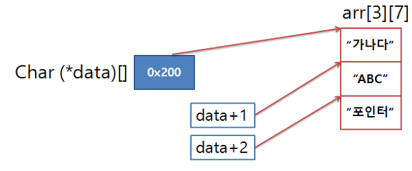
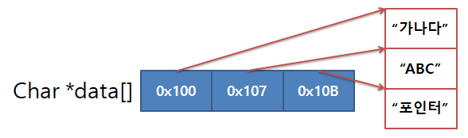

## **Overview**
Welcome to Week 9 of C programming! This week, we will explore pointer. By the end of this tutorial, you will:
- Understand the basic concept of pointer
- Understand the difference between pointer to an array and pointer array (배열 포인터 vs 포인터 배열)
- Understand the double pointer
- Understand call-by-reference
### **Time Breakdown**
- **Introduction to a pointer**
- **Pointer to an array, and Pointer array**
- **double pointer**
- **call by reference**
- **Exercises & Q/A**

---

## **1. Pointer **
Pointer is a variable that stores the "memory address".  
*: Dereference operator  
&: Address-of operator  
%p: Format specifier for printing adresses  
### **Example:** How to define and use a Pointer
```c
int a = 10;
int *p = &a;

printf("value of a: %d\n", a);
printf("address of a: %p\n", &a);
printf("value of p: %p\n", p);
printf("value of *p: %d\n", *p);

```
### **Example Output:**
```
value of a: 10
address of a: 0x7ffee45c489c
value of p: 0x7ffee45c489c
value of *p: 10
```

---

## **2. Pointer to an array vs Pointer array **
Pointer to an array (배열 포인터) : It is a singular pointer that points to a certain type of "array".  
-It is usually used when the parameter is 2-dimensional array.  

Pointer array (포인터 배열) : An array that holds pointers as its elements.  

### **Example:** Pointer to an array vs Pointer array
```c
#include <stdio.h>

int main() {
  // Pointer to an array
    char arr[3][7] = { "ABC", "DEF", "Point"};
    char (*data1)[7] = arr;  // 7개의 char로 이루어진 배열의 주소를 저장

    for (int i = 0; i < 3; i++) {
        printf("data1[%d]: %s\n", i, *(data1+i));
    }
    printf("===========================\n");
   // Pointer array
    char *data2[]={"ABC123456", "DEF", "Point"};
    for (int i = 0; i < 3; i++) {
        printf("data2[%d]: %s\n", i, data2[i]);
    }


    return 0;
}

```
## Pointer to an array  
    

## Pointer Array

  


### **Example Output:**
```
data1[0]: ABC
data1[1]: DEF
data1[2]: Point
===========================
data2[0]: ABC123456
data2[1]: DEF
data2[2]: Point
```

---

## **3. Double Pointer **
Double pointer is a variable that stores the "memory address of pointer".

### **Example:** calculate the sum from 0 to n
```c
void modify(int **double_ptr) {
    **double_ptr = 999;
}

int main() {
    int x = 10;
    int *p = &x;
    modify(&p);
    printf("value of x: %d\n", x);
}


```
### **Example Output:**
```
value of x: 999
```
---

## **4. Call by reference **
Pointers allow modifying variables outside the function.  

### **Example:** How to define and use a Pointer
```c
#include <stdio.h>

void swap(int *x, int *y) {
    int temp = *x;
    *x = *y;
    *y = temp;
}

int main(void) {
    int a = 5, b = 10;
    swap(&a, &b);
    printf("After swapping: a = %d, b = %d\n", a, b);
    return 0;
}

```
### **Example Output:**
```
After swapping: a = 10, b = 5
```

---

### **Exercise 1: change multiple values in a function using pointers. **
1. Initialize 4 int variables.
2. Write a function that adds 1 to each variable.
3. print the result

   
### **Example Output **
```
=====before change=====
a = 1, b = 2, c = 3, d = 4
=====after change=====
a = 2, b = 3, c = 4, d = 5
```

### **Exercise 2: Find Maximum Value Using Pointers ** 
Write a program to find the maximum value in an array using pointers.  
You can initialize the array in the way you want:  
Eg.) int array[6] ={3, 2, 4, 22, 15, 6, 8};


### **Example Output **
```
Maximum value = 22
```

### **Exercise 3: Find an Alphabet in a word **
1. Please get an alphabet from a user.
2. Please get a word from a user.
3. Check if the word includes the alphabet 'using pointer'.
   (Please find it using pointer arithmetic, not array index access.) 
4. Print if the alphabet is found.

   
### **Example Output **
```
Please input the alphabet you want: i
Please input the word you want: apple
cannot find i!
```
```
Please input the alphabet you want: a
Please input the word you want: grammer
found a!
```
---
